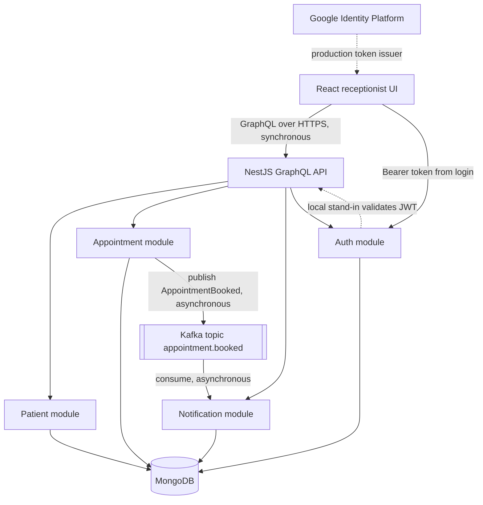
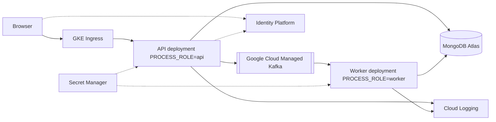

# Architecture

Harbor Clinic is an administrative scheduling desk. It registers fictional patients, books 30-minute doctor appointments, and records a confirmation when a booking event is processed. It is not an electronic medical record.

## Choice

The implementation is a **modular monolith**: one NestJS deployable with three business modules that do not call each other across the booking/notification boundary except through an event.

A microservice split would add a network hop, a second database or a shared-database trap, and a deployment story that this exercise does not need yet. The module boundaries are already the ones a later split would use. `PROCESS_ROLE=api|worker|all` lets the same image run as the GraphQL API or as the notification worker.

## Modules

| Module | Responsibility | Talks to |
| --- | --- | --- |
| Patient | Register and search patients | MongoDB `patients` |
| Appointment | Book, list, cancel, publish `AppointmentBooked` | MongoDB `appointments`, Patient and Doctor modules, Kafka |
| Notification | Consume `AppointmentBooked` and store a confirmation | Kafka, MongoDB `notifications` |
| Doctor | Seeded doctor directory | MongoDB `doctors` |
| Auth | Issue and validate JWTs, enforce roles | MongoDB `users` |

The notification module does not import the appointment module. It understands only the event contract in `backend/src/contracts/appointment-booked.event.ts`.

## Synchronous and asynchronous paths

- Receptionist actions are synchronous GraphQL mutations and queries. The booking mutation returns when the appointment is stored. It does not wait for a notification to be visible.
- The confirmation is asynchronous. The appointment document carries outbox state (`PENDING`, `PUBLISHING`, `PUBLISHED`, `FAILED`). A poller retries unpublished bookings. The notification consumer writes one record per `eventId`.
- With `KAFKA_ENABLED=false`, a process-local bus calls the same notification handler. That path is only for a laptop without a broker. Docker Compose uses Kafka.

## GraphQL

There is one code-first schema. Nest merges resolvers from each module. There is no gateway. See `docs/adr/002-graphql-composition.md`.

## Proposed Google Cloud shape

Local development uses Docker Compose for MongoDB and Kafka, or `MONGODB_URI=memory` when those are not installed. A paid cloud project is not required to run the vertical slice.